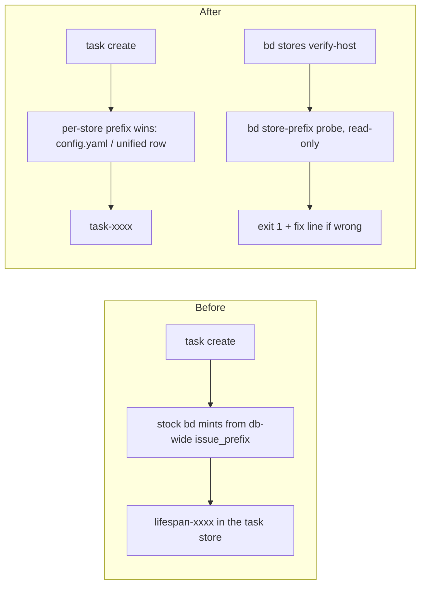

```mermaid
flowchart LR
  subgraph Before
    A1[task create] --> B1[stock bd mints from db-wide issue_prefix] --> C1[lifespan-xxxx in the task store]
  end
  subgraph After
    A2[task create] --> B2[per-store prefix wins: config.yaml / unified row] --> C2[task-xxxx]
    V[bd stores verify-host] --> P[bd store-prefix probe, read-only] --> R[exit 1 + fix line if wrong]
  end
```
