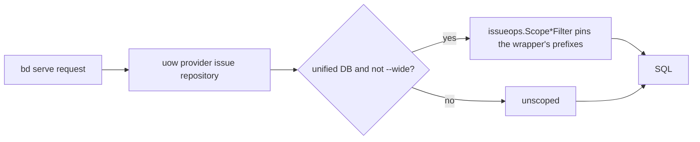

```mermaid
flowchart LR
  A[bd serve request] --> B[uow provider issue repository]
  B --> C{unified DB and not --wide?}
  C -- yes --> D[issueops.Scope*Filter pins the wrapper's prefixes]
  C -- no --> E[unscoped]
  D --> F[SQL]
  E --> F
```
