# Brain over Beads

What brain does that upstream beads does not, and how each of the new features works. This page is the picture-first companion to [`WHAT_BRAIN_ADDS.md`](WHAT_BRAIN_ADDS.md) (the inventory, with state and evidence per feature). Each section here shows one feature as a diagram and a few lines of prose, then points at the page that holds the detail.

Brain was forked from beads at `1.1.0-rc.1`. Upstream is now at `1.3.1`. Every comparison below is against **beads 1.3.1**, and it says where upstream has started to catch up. The diagrams are written for GitHub's Mermaid renderer.

Contents: [the gap at a glance](#the-gap-at-a-glance) · [stores and the unified database](#stores-and-the-unified-database) · [one write, end to end](#one-write-end-to-end) · [guard and observer hooks](#guard-and-observer-hooks) · [durable event outbox](#durable-event-outbox) · [markdown edit-back](#markdown-edit-back-and-mark-for-deletion) · [prefix claim, release, history](#prefix-claim-release-and-history) · [conflict beads](#conflict-beads) · [shared-database backup](#shared-database-backup)

## The gap at a glance

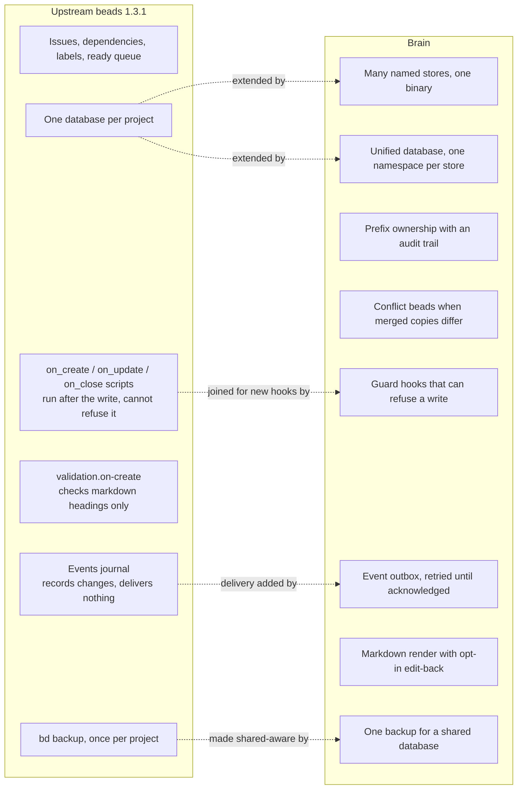

| Need | Upstream beads 1.3.1 | Brain |
|---|---|---|
| Refuse a bad write | No. The `on_*` scripts run after the write and cannot refuse it. `validation.on-create` can only check markdown section headings. | A guard hook sees the proposed write first and can refuse it, naming itself. |
| Tell other systems about changes | The events journal (`bd events`) records changes. Nothing sends them anywhere. | The outbox delivers each event to HTTP or command subscribers and retries until every one acknowledges. |
| Many trackers on one machine | One database per project. `bd federation` means peer sync across machines, which is a different thing. | A registry of named stores, a wrapper per store, federated search, and one unified database with namespaces. |
| Who owns an id prefix | A static `allowed_prefixes` list, which `--force` on `bd create` bypasses. | Ownership is recorded and enforced on every mint, and `--force` cannot bypass it on the unified database. Claims and releases are logged. |
| Beads as markdown files | No. | Every bead is rendered to `entries/`. Edits can flow back if the store allows it. |

Brain's own rules for the hooks, the outbox and the backup are not repeated here; each section links to the page that owns them.

## Stores and the unified database

Each store is a small wrapper command that pins `BD_NAME` and the database location. Since the switchover, the stores share one database, `brain_unified`, and each store sees only its own namespace unless asked to look wider (`--wide`). See [`WHAT_IS_BRAIN.md`](WHAT_IS_BRAIN.md) for the federation and [`MERGING_DATABASES.md`](MERGING_DATABASES.md) for how separate store databases become one.

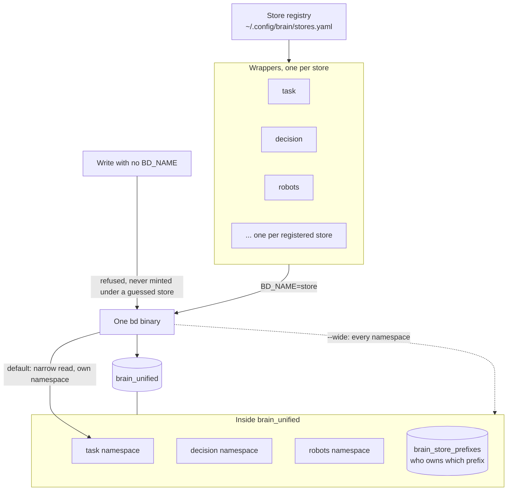

## One write, end to end

This is where the new features plug in. The store is wrapped in layers (`PersistentPreRunE` in `cmd/bd/main.go` builds them): the guard hooks sit closest to the database, the legacy `on_*` script hooks wrap them, and the markdown renderer is outermost. The outbox is not a store layer. It runs in `PersistentPostRunE`, after the command's write.

On a write, the order is:

1. Before the command runs: the `hooks.d` definitions are loaded (a malformed one refuses every command that could write), the store is opened and wrapped, and the outbox preflight checks the backlog.
2. Guards run first, before the write. The first refusal wins.
3. The write and its Dolt commit.
4. Declared observers run, in the same layer as the guards.
5. The legacy `on_create` / `on_update` / `on_close` scripts run.
6. The markdown file is rendered.
7. After the command returns: one outbox row per changed bead, then the Dolt auto-commit, auto-backup, the opportunistic outbox delivery pass, and the outbox commit.

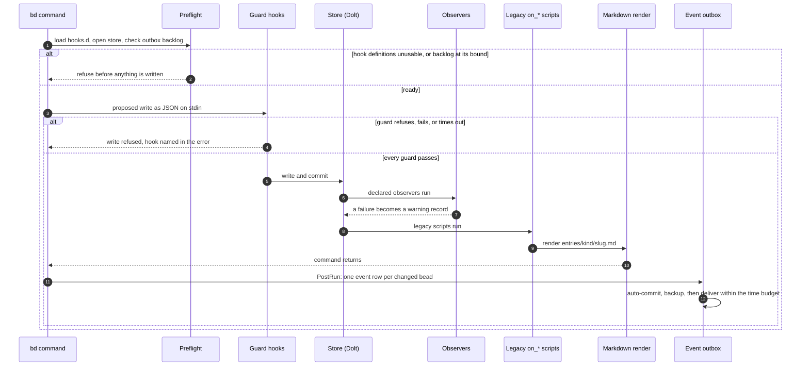

## Guard and observer hooks

`bd hook list` · `bd hook warnings` · `bd hook test`

Each hook is one TOML file in `.beads/hooks.d/` with a `run` command, a `when` event, and a declared `policy`. The policy decides what a failure means. Upstream's `.beads/hooks/on_*` scripts still work alongside and still cannot refuse. Full reference: [`HOOKS.md`](HOOKS.md).

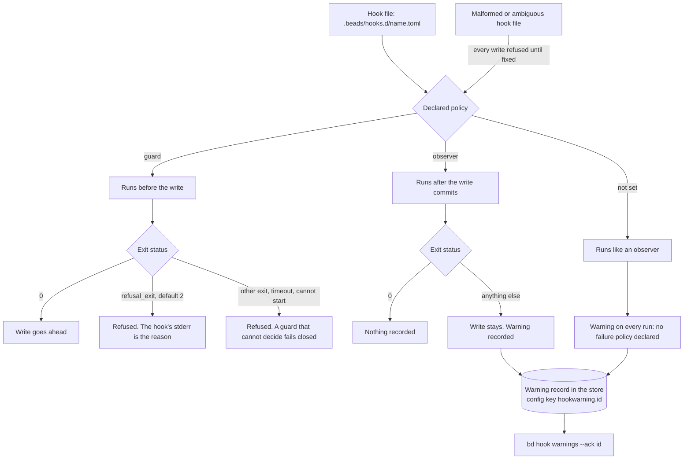

### A hook can observe and refuse, but never write

A hook that runs `bd create` itself is stopped by three independent layers, each of which holds if the one before it is defeated.

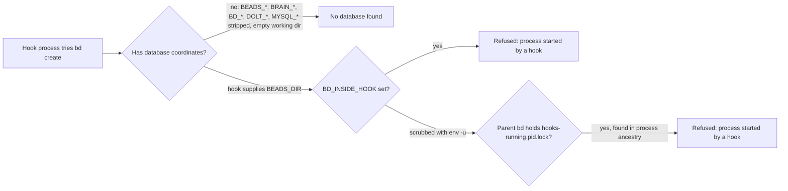

### Where shaped-data checks belong

A required shape for a bead is a guard hook. This example refuses a `decision` bead that does not carry an options list, and lets everything else through. It was tested on a scratch store (a fresh `bd init` under its own `HOME`, a binary built with `CGO_ENABLED=1 go build -tags gms_pure_go`), with `bd hook test` and two real `bd create` calls.

```toml
# .beads/hooks.d/decision-shape.toml
policy = "guard"
when   = "create"
run    = '''
jq -e '.issue.issue_type != "decision"
       or ((.issue.description // "") | test("(^|\n)Options:\n- "))' >/dev/null \
  || { printf "%s\n" "decision beads need a description with an 'Options:' line followed by a '- ' list" >&2; exit 2; }
'''
```

The hook payload carries `id`, `title`, `description`, `status`, `priority`, `issue_type`, `assignee`, `labels` and `created_by`. It does **not** carry `metadata`, so a guard cannot check metadata keys. A first version of this example that tested `.issue.metadata.options` refused every `decision` bead, including one created with valid `--metadata`, because the field is absent from the payload. The example therefore checks the description, which the payload does carry. A check that must read metadata has no hook today.

With `jq` on `PATH`, a decision whose description has no `Options:` list is refused, and one with the list passes:

```
$ bd hook test decision-shape --payload-file p-bad.json     # description: "we need a database"
exit:    2
stderr:  decision beads need a description with an 'Options:' line followed by a '- ' list
verdict: REFUSE: bead not created: refused by guard hook "decision-shape" (…/.beads/hooks.d/decision-shape.toml): …

$ bd hook test decision-shape --payload-file p-good.json    # description ends "Options:\n- dolt\n- sqlite"
exit:    0
verdict: pass

$ bd create "pick a db" -t decision -d "we need a database"
Error: bead not created: refused by guard hook "decision-shape" (…): decision beads need a description with an 'Options:' line followed by a '- ' list      # exit 1

$ bd create "pick a db" -t decision -d $'we need a database\nOptions:\n- dolt\n- sqlite'
✓ Created issue: scratch-g19 — pick a db                                                                          # exit 0
```

> **Limits.** Import, `bd dolt pull` merges, compaction and delete-by-source-repo bypass the guarded store methods, and proxied-server mode refuses writes while hooks are declared. A status change through `bd update --status closed` is an `update` event, not a `close` event. A refusal is not recorded as a warning. It shows up only as the command's error.

## Durable event outbox

`bd outbox list` · `deliver` · `ack` · `record` · `purge`

The outbox is opt-in with `change-events.outbox.enabled`. Every write adds one row per changed bead to the store's own `event_outbox` table. The row is versioned in Dolt and freezes the list of subscribers at that moment. Delivery is at least once, and subscribers drop duplicates on (`store`, `seq`). Full reference: [`event-outbox.md`](event-outbox.md).

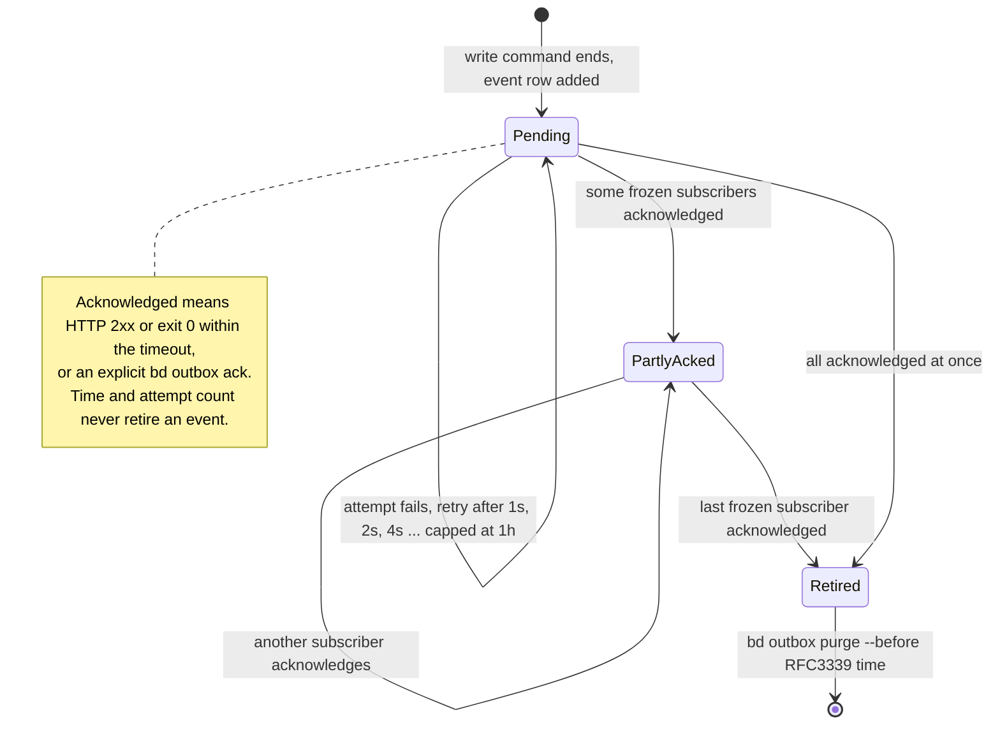

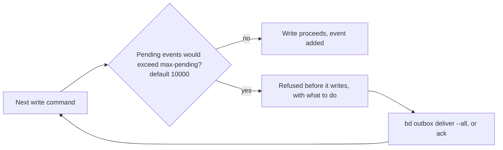

The check is `pending + 1 > max-pending`, made in the preflight before the command mutates anything. The `outbox` verbs, `config`, `vc`, `dolt`, `doctor`, `version`, `help` and the read-only commands are exempt, so the operator can always get out.

> **Limits.** The event is inserted in a second transaction just after the write (in the command's post-run), so a process killed in that window leaves a committed write with no event. `bd outbox record <issue-id> --command <name>` repairs that by hand. Closing the window needs the insert inside the store's mutation transaction, which is left as a follow-up. There is no delivery daemon: retries happen after writes or when someone runs `bd outbox deliver`. Server-mode stores only; an embedded store refuses writes while the outbox is enabled.

## Markdown edit-back and mark-for-deletion

`bd render-import` · `bd render-marks` · `bd stores edit-back`

Brain renders every bead to `entries/kind/slug.md`. Edit-back lets a store accept edits made to those files. It is off by default, per store, and a deleted file never deletes a bead. Full reference: [`EDIT_BACK.md`](EDIT_BACK.md).

The checks run in this order, for every store. Whether the store declared `edit_back` is decided last: a store that did not declare it still gets every refusal below, and a file that would have been applied is reported as ignored instead.

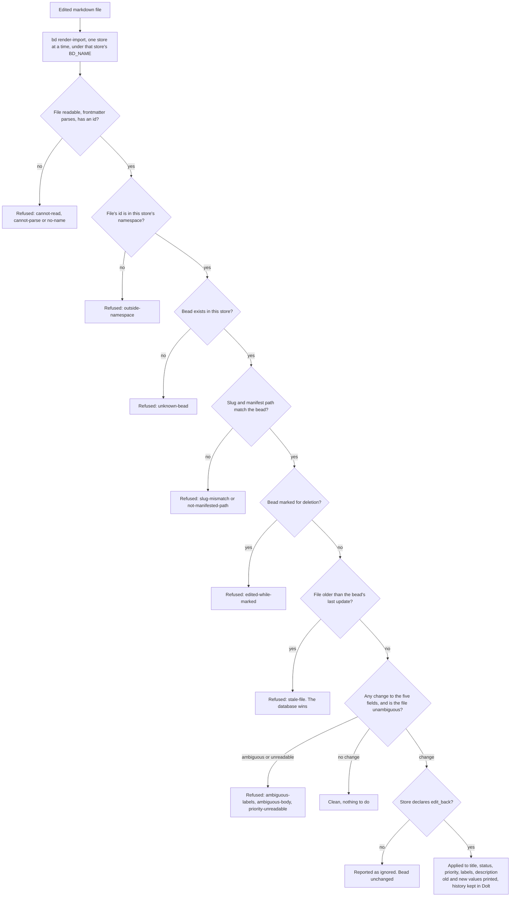

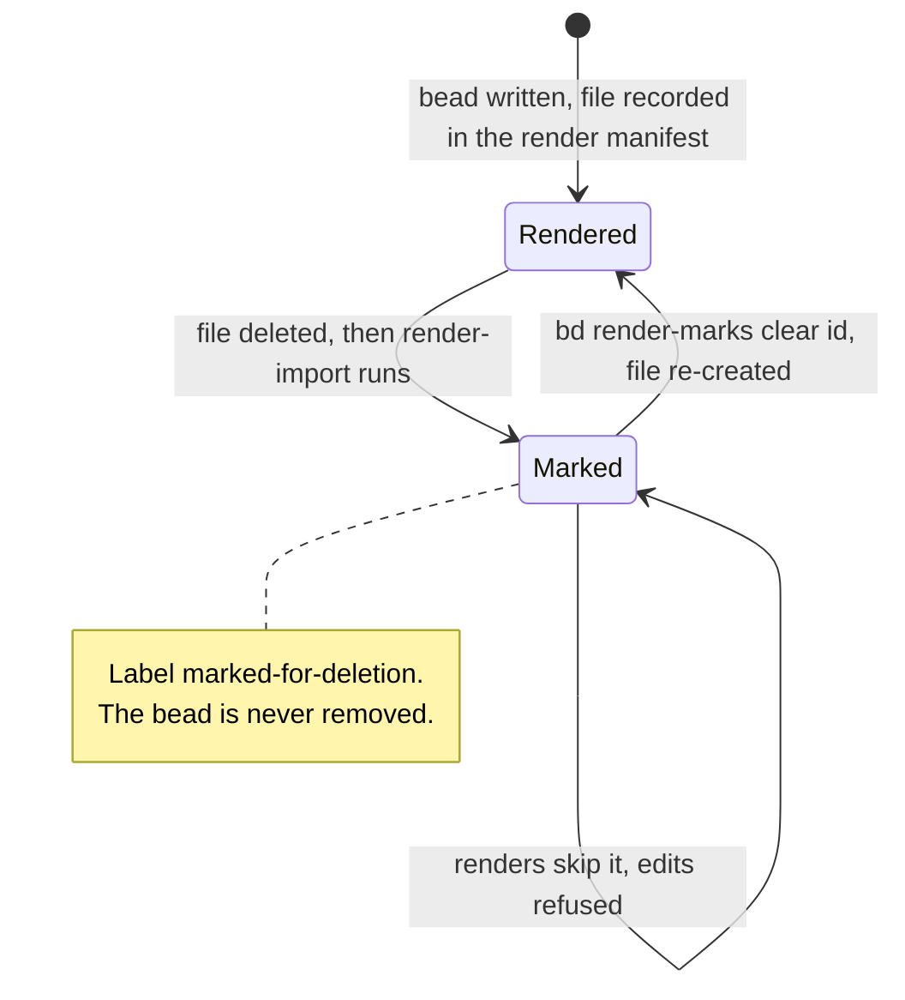

The deletion scan reads the render manifest (`entries/.render-manifest.json`) and runs on every `render-import`, whatever the store's edit-back setting. Without a manifest, deletions are not scanned and the run says so.

> **Limits.** Nothing schedules `render-import`; it is an explicit run. A moved file reads as a deletion of the old path plus a refusal of the new one. The stale check compares to the second with 2 seconds of slack, so a real edit within 2 seconds of a render is not detected as stale.

## Prefix claim, release, and history

`bd store-prefix add` · `release` · `history`

On the unified database, every id prefix has one recorded owner, checked on every mint, and `--force` cannot bypass it. Every claim and release writes an event in the same transaction, to the append-only `brain_store_prefix_events` table. Full reference: [`PREFIX_RELEASE.md`](PREFIX_RELEASE.md).

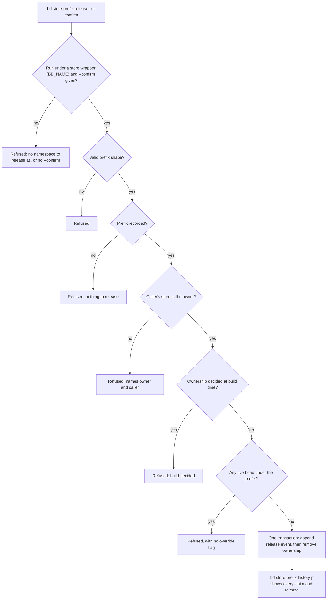

> **Limits.** The trail starts at adoption: a claim made before the event table existed has no event row, and `history` says so instead of inventing one. A transfer is two acts (release, then claim), and the next claim wins the gap between them.

## Conflict beads

When `bd brain unify` merged the separate store databases, 31 ids existed in more than one store with different content. Brain keeps every copy instead of picking a winner, and leaves an open conflict bead at the original id. The 92 identical duplicates (of 123 duplicated ids) were merged into one bead each. This is the real example from the merge. Full reference: [`MERGING_DATABASES.md`](MERGING_DATABASES.md#duplicated-ids-identical-copies-merge-differing-copies-become-conflict-beads).

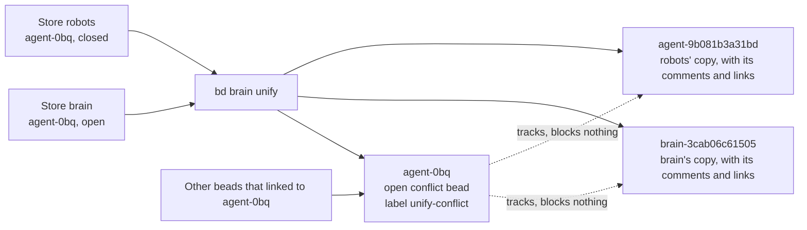

The new ids are the authoring store's prefix plus the first 12 hex characters of `sha256(original id, 0x00, store)`, so a rebuild or replay produces the same ids.

> **Limits.** There is no command yet to resolve a conflict bead (fold the copies, close one, close the conflict). A `blocks` link to a conflicted id is kept, so it now waits on the open conflict: in the real data, 8 inbound `blocks` rows (4 in the brain store, 4 in the task store) are in that position.

## Shared-database backup

Upstream auto-backup runs once per project. On a database shared by many stores, that meant one private copy of the same data per store. Brain recognises the shared database and backs it up once, to the `default` destination registered with `bd backup init <path>`. See the Auto-Backup section of [`../CONFIG.md`](../CONFIG.md#auto-backup).

The checks run in this order. The throttle and the change check are made twice, once before and once after taking the lock, because the store that held the lock may have just finished a backup.

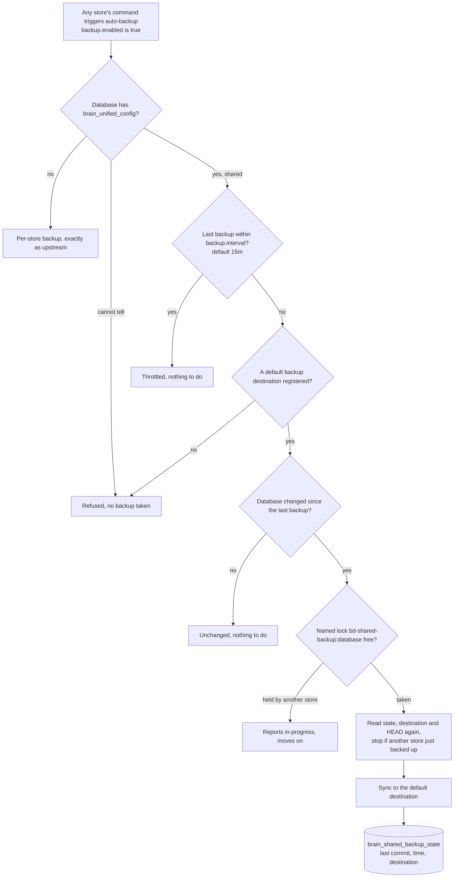

> **Limits.** Every refusal prints a warning that no backup was taken. It never falls back to a per-store copy.

## Sources

Upstream behaviour was checked against an installed `bd 1.3.1`. Brain behaviour was checked against the code on this branch: `cmd/bd/main.go` (`PersistentPreRunE`, `PersistentPostRunE`), `internal/storage/hook_guard_decorator.go`, `internal/hooksdef/`, `cmd/bd/outbox*.go`, `internal/brain/editback/editback.go`, `internal/storage/issueops/unified_namespaces.go`, `internal/brainunify/conflict.go` and `internal/storage/versioncontrolops/shared_backup.go`.
